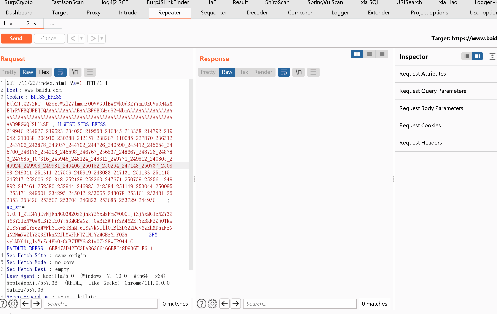

# start4burp++ | burp联动插件
## 0x01 插件简介
start4burp++对[sqlmap4burp++](https://github.com/c0ny1/sqlmap4burp-plus-plus)进行了重构,可在多个平台下快速联动Burp与任何命令行工具。




## 0x02 插件编译

```
mvn package
```

## 0x03 插件填写规则
1. Run Name: 填写运行环境文件，如python3、python2等
2. Plugin Path: 填写插件路径，如dirsearch.py文本位置。 sqlmap.py文件位置
3. Cmd option: 填写需要运行的参数。如何 dirsearch参数： -u {{url}}
内置参数如下：

| 参数    |  值   |
| --- | --- |
| {{root_url}} | 完整url，如：http://baidu.com:1123/aad/c/1.txt |
|    {{url}} |    url地址：如http://baidu.com/ |
|  {{file}}   |   数据包保存文件地址  |
|   {{domain}}  |   域名信息，如：www.baidu.com  |
|  {{root_main}}    |   根域名信息,如：baidu.com  |
|  {{urldir2}}   |   url+二级目录 如： http://baidu.com/2/ |
|  {{port}}   |   返回端口号  |

## 0x04 FQA
#### 1.在macOS下无法弹出Terminal？
出现这种情况，一般有以下两个原因。
* 原因一：没有允许运行外部`Burp suite`运行`osascript`。
* 原因二：没有启动终端（Terminal），请将其启动。若已经是运行状态，那么请重启它！

#### 2.在Linux下弹出Terminal，为何没有执行命令呢？
这是正常现象，插件已经将命令复制到剪贴板，将其粘贴到弹出的命令窗口即可！目前插件在Linux下暂时无法实现启动Terminal的同时使其运行sqlmap命令，所以暂时采用这种临时的方法。

#### 3.插件每次都必须要配置`Run name`和`Plugin path`么？
这两个配置是插件保证正常运行的关键，每个插件为不同的值。需为每个插件分别配置。
## 0x05 参考项目
* https://github.com/blueroutecn/Burpsuite4Extender
* https://github.com/c0ny1/sqlmap4burp-plus-plus